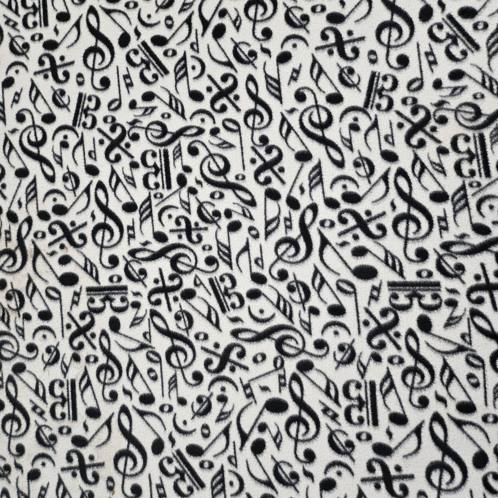

<link rel="stylesheet" href="assets/css/style.css">

<!-- Tiny extras to style dropdowns and captions nicely -->

# Project 2: 🌟 Image Homography and Warping

This project explored how 2D transformations can manipulate and align images using homography and warping.  
**Part 1** focuses on rectification (manual correspondences).  
**Part 2** poster projection, then an automatic pipeline (vanishing points, masking, contour scoring).  
**Part 3** compares **Triangular Mesh (Piecewise Affine)** vs **Thin Plate Spline (TPS)** warping.

💫 <strong>Tip:</strong> Many sections below are <em>clickable</em> — tap the golden pulsing stars to expand or collapse detailed discussions, results, and reflections.

## Part 1 — 🌌 Homography & Manual Rectification

<!-- Step: Input -->

<strong>1) Input capture and goal ✨ </strong>

I started with a photo of a flat paper taken at an angle. The goal: compute a **homography** that maps the four corners to a rectangle, producing a **fronto-parallel rectified view**.

  
   Input photo (oblique view of a planar surface).

<!-- Step: Rectified -->

<strong>2) Corner correspondences → Homography (DLT) → Rectification ✨</strong>

I manually clicked the poster corners, assembled source→target correspondences, and solved for the homography \(H\) using DLT.  
Applying inverse warping produced a rectified output where **straight lines stay straight**, and the surface appears as if the **camera moved** to face it head-on.

  
   Manual correspondences (used only for debugging checks).

  
   Rectified result: planarity preserved, perspective corrected.

<strong> Discussion – How homography enables rectification ✨  </strong>

Homography mathematically defines the projective relationship between two planes.  
By estimating the matrix \(H\) from four or more corresponding points, the image can be re-projected so that the plane in the photo maps directly onto a fronto-parallel view.  
This effectively *undoes perspective distortion*: lines that were converging due to camera angle become parallel again, and the surface appears as though the camera were facing it head-on.  
In practice, this lets any planar region—posters, signs, or screens—be rectified into a measurable, undistorted view.

##  Part 2 — 🌌 Planar Warping & Texture Placement

<!-- Step: Virtual poster -->

<strong>1) Virtual texture placement ✨ </strong>

To validate the rectified geometry, I overlaid a virtual poster/texture in the rectified domain and reprojected it.  
Because homography respects planar projective geometry, the texture sits realistically on the surface without bending.

  
    texture to be projected.

<strong>2) Baseline – Rectified AR Poster Projection ✨ </strong>

Part 2 begins by extending the rectification work from Part 1 into a simple **augmented-reality placement** task.  
Using the computed homography, I projected a poster image directly onto a planar surface in a new scene.  
Because the transform preserves projective geometry, the poster adheres convincingly to the wall without bending—this forms the **baseline result** required for Part 2.

  
   Original scene prior to poster projection.

  
   Initial projection using clicked points.

---

<strong>3) Observations and Limitations of the Baseline ✨ </strong>

The baseline successfully made the poster appeared naturally attached to the surface.  
However, it still relied on manual point correspondences.  
i wanted to automatically determine points: in new scenes, the quad had to be chosen by hand, and noise or camera angle changes could break the illusion.  
These observations motivated my attempt to **automate the planar region detection and point choice** process.

---

<strong>4) Extension – Toward Automatic Placement ✨ </strong>

To remove manual selection, I experimented with using the image’s geometry itself to infer placement regions.  
I detected strong line segments with **Canny + Hough**, grouped them by orientation, and estimated **vanishing points** to sketch perspective-aligned quads.  
This allowed the system to propose plausible surfaces autonomously—essentially guessing where a wall or poster might exist.

---

<strong>5) Added Improvements – Masking and Quad Scoring ✨ </strong>

While promising, the first automatic results were unstable in cluttered or low-contrast scenes.  
To improve consistency, I added:

- a **keep-mask** to down-weight shadows and saturated areas,  
- and **contour scoring** to prefer quads with near-right angles and balanced sides.  

These filters helped the algorithm ignore distracting edges and choose more reliable surfaces.

   
  Vanishing-point-oriented line detection.

   
  Heuristic keep-mask filtering shadows and highlights.

   
  Candidate quadrilateral proposals (debug view).

---

<strong>6) Final Hybrid Result ✨ </strong>

By combining **vanishing-point inference**, **mask filtering**, and **contour scoring**, the system achieved robust, hands-free texture placement across multiple scenes.  
The resulting projection required no user input and maintained realistic perspective even under challenging conditions.

  
   Improved automatic placement with mask + scoring.

  
   Hybrid method result — geometry + heuristics for stable warping.

---

<strong> Discussion – Idea, Successes, and Challenges ✨ </strong>

**Idea.**  Use projective geometry to place textures automatically, removing manual correspondences.  

**What worked.**  The homography-based projection preserved realism, and the added heuristics made the placement self-sufficient in most scenes.  

**Challenges.**  Highly cluttered backgrounds or uneven lighting could still mislead the vanishing-point solver, occasionally generating “floating” placements.  
Even so, these experiments demonstrated that careful geometric reasoning alone can achieve near-AR-quality placement without learning-based assistance.

## Part 3 — 🌌 Triangular Mesh vs Thin-Plate Spline (TPS)

<!-- Step: Digit verification -->

<strong>1) Verification on digits (3-a → 3-b) ✨ </strong>

I first warped one “3” to another using both **Piecewise Affine (PWA)** and **TPS**.  
PWA is piecewise linear (triangles), continuous but not smooth across edges; TPS is globally smooth, minimizing bending energy while interpolating landmarks exactly.  
Both passed a landmark RMSE ≈ 0 check.

  
   Digit “3” warp comparison (PWA left vs TPS right).

<!-- Step: Cat → Bulbasaur -->

<strong>2) Cat → Bulbasaur smile (creative comparison) ✨ </strong>

Warping my cat (Saleen) to match **Bulbasaur’s** grin made the differences pop:
- **PWA**: locally rigid triangles create a faceted, wedge-like reshaping near the mouth.  
- **TPS**: landmarks act like pins in a rubber sheet—mouth pulls propagate globally, “inflating” the lower face.

Neither is “wrong”—they’re each **correct** under their continuity assumptions. TPS is global + smooth; PWA is local + linear.

  
   “Catasaur” — aligning a cat’s facial landmarks to Bulbasaur’s smile.

<!-- Step: Summary panel -->

<strong>3) Discussion & takeaways ✨ </strong>

**Rectification vs Warping.** Rectification with a homography is like **moving the camera** so the plane faces you.  
Warping is like **bending the surface** in 2D to force points to new locations.

**Why TPS bends the whole image.**  
TPS solves  
$$ f(\mathbf{p}) = a_0 + a_x x + a_y y + \sum_i w_i\,U(\|\mathbf{p}-\mathbf{c}_i\|), \quad U(r)=r^2\log r^2. $$
Because \(U\) has global support, moving a landmark influences the entire field smoothly.

**Why PWA looks faceted.** PWA triangulates the domain and applies affine maps per triangle (C⁰ continuous, not C¹).  
It preserves local linearity but introduces visible seams if landmarks are sparse or far apart.

**Practical guidance.**  
Use **PWA** when you want localized, geometry-faithful changes (rigid-ish regions).  
Use **TPS** for organic, globally smooth deformations (faces, handwriting).  
Adding **anchor points** (cheeks/chin) localizes TPS; adding **more triangles** smooths PWA transitions.

  
   Part 3 overview panel.

## Conclusions 🌠

- **Homography** gives planar, projective alignment (rectification) — it preserves straight lines and mimics moving the camera.  
- **PWA** provides local, piecewise-linear control; good for rigid patches.  
- **TPS** enforces global smoothness; great for non-rigid alignment, but deforms broadly unless anchored.  
- The Cat→Bulbasaur demo shows both are mathematically correct—just different continuity assumptions and deformation behavior.

**Author:** Joseph Janicki · **Course:** Computer Vision · **Term:** Fall 2025

